# Calo — Architecture

This describes what is actually implemented in this repository as of 23 Sep
2026, traced from the real source files, not from the pitch deck. Where a
step is unverified on a real device, that's noted inline — see
`KNOWN_LIMITATIONS.md` for the full list.

Two Gradle modules:

```
domain/   pure Kotlin/JVM, zero Android imports — the decision logic
app/      Android adapter layer — AccessibilityService, Room, SpeechRecognizer, OkHttp
```

`:app` never makes a decision `:domain` doesn't own. `CredentialGateRules`,
`ReplayPlanner`, `SlotResolver`, `NluPrompt`, and `NluResponseParser` all
live in `:domain` and are unit-tested there; `:app` classes with matching
names (`CredentialGate`, `ReplayEngine`, `NLUClient`) are thin adapters that
walk real `AccessibilityNodeInfo` trees or make the real HTTP call, then
hand off to the domain object for the actual decision.

## End-to-end call path

```mermaid
flowchart TD
    subgraph TEACH["Teaching a flow"]
        A1["User taps 'Teach a Flow' (MainActivity)"] --> A2["CaloAccessibilityService.startTeaching()<br/>creates TeachRecorder, mode = TEACHING"]
        A2 --> A3["User demonstrates the flow in the target app"]
        A3 --> A4["onAccessibilityEvent:<br/>CLICK / TEXT_CHANGED / SCROLLED"]
        A4 --> A5["TeachRecorder.anchorFor(node):<br/>resourceId, text, contentDescription,<br/>className + indexInParent"]
        A5 --> A6["FlowStep appended; source node recycled"]
        A6 --> A3
        A3 --> A7["User taps 'Finish Teaching'"]
        A7 --> A8["MainActivity.beginFinishTeaching():<br/>the one stopTeaching() call"]
        A8 --> A9{"Any promotable step?<br/>(SET_TEXT value, or CLICK with visible text)"}
        A9 -- yes --> A10["dialog_promote_slots:<br/>user names a slot per row, or leaves blank"]
        A10 --> A11["TeachRecorder.promoteToSlot(stepOrder, name)<br/>per named row"]
        A9 -- no --> A12
        A11 --> A12["dialog_finish_teaching:<br/>trigger phrase + description"]
        A12 --> A13["CaloOrchestrator.saveTaughtFlow():<br/>builds SlotDefinition list,<br/>Room save via FlowRepository"]
    end

    subgraph REPLAY["Voice command to replay"]
        B1["User taps the marble"] --> B2["VoiceInputManager:<br/>android.speech.SpeechRecognizer"]
        B2 --> B3["Raw utterance string"]
        B3 --> B4["CaloOrchestrator.handleUtterance():<br/>load every LearnedFlow, build one<br/>CandidateFlow per flow (all apps)"]
        B4 --> B5["NluPrompt.build():<br/>utterance + every flow's trigger phrase /<br/>description / slot names, one prompt"]
        B5 --> B6["NLUClient.match():<br/>single POST to Groq chat/completions"]
        B6 --> B7["NluResponseParser.parse():<br/>strip markdown fence, every field optional"]
        B7 --> B8{"matchedFlowId resolves to<br/>a stored LearnedFlow?"}
        B8 -- no --> B9["Status: didn't recognize the utterance"]
        B8 -- yes --> B10{"flow.targetPackage already<br/>the foreground app?"}
        B10 -- no --> B11["launchAndWaitForForeground():<br/>launch intent, poll up to 5s"]
        B11 --> B12
        B10 -- yes --> B12["ReplayEngine.replay(steps, slotValues)"]
        B12 --> B13["ReplayPlanner.replay() loop (domain, pure)"]
        B13 --> B14["CredentialGateRules.classify()<br/>BEFORE every single step"]
        B14 -- Blocked --> B15["Halted — zero further taps or text entry"]
        B14 -- Clear --> B16["NodeWalker.resolve(anchor):<br/>resourceId &gt; text &gt; contentDescription &gt;<br/>className + indexInParent"]
        B16 --> B17["SlotResolver.resolveValue()<br/>(SET_TEXT only): slot value, else recordedValue"]
        B17 --> B18["performClick / performSetText / performScroll"]
        B18 --> B19{"more steps?"}
        B19 -- yes --> B14
        B19 -- no --> B20["Completed"]
    end
```



## 1. Speech-to-intent

`VoiceInputManager` (`app/.../voice/VoiceInputManager.kt`) wraps
`android.speech.SpeechRecognizer` directly: one `ACTION_RECOGNIZE_SPEECH`
intent with `LANGUAGE_MODEL_FREE_FORM`, one `RecognitionListener`. Only
`onResults` and `onError` are wired to anything — `onResults` takes the
*first* string out of `RESULTS_RECOGNITION` and nothing else (no partial
results, no n-best re-ranking); `onError` reports the raw platform error
code as text (`"speech recognizer error code $error"`), not a decoded
human-readable reason.

`CaloOrchestrator.handleUtterance()` (`app/.../orchestrator/CaloOrchestrator.kt`)
receives the raw utterance and:

1. Loads **every** `LearnedFlow` from `FlowRepository` (Room), not just
   flows for the app currently in front — the user can speak a command for
   a different app than whatever's open. Each flow becomes a
   `CandidateFlow(id, triggerUtterance, description, slotNames)`.
2. `NluPrompt.build(utterance, candidates)` (`domain/.../nlu/NluPrompt.kt`)
   builds a single prompt: the spoken command, every candidate flow's
   taught trigger phrase + description + slot names, and instructions to
   match by *meaning* (not exact wording), extract only slot values
   actually mentioned, and reply with `matchedFlowId` / `slotValues` /
   `confidence` as bare JSON, no markdown fences.
3. `NLUClient.match()` (`app/.../nlu/NLUClient.kt`) POSTs that prompt as
   the sole message to Groq's OpenAI-compatible endpoint
   (`https://api.groq.com/openai/v1/chat/completions`), model
   `openai/gpt-oss-20b`, `temperature = 0.0`. One HTTP call, no retries, no
   streaming.
4. `NluResponseParser.parse()` (`domain/.../nlu/NluResponseParser.kt`)
   parses the response defensively, by design, because the far end is an
   LLM completion, not a typed API contract:
   - Strips a leading/trailing ```` ```json ```` or ```` ``` ```` fence
     before parsing, if present.
   - Every field is optional. `matchedFlowId` missing, `null`, blank, or
     the literal string `"null"` all collapse to `null`. `slotValues`
     missing or not an object collapses to an empty map; non-string values
     inside it are dropped rather than crashing the parse. `confidence`
     missing or non-numeric defaults to `0.0`; any numeric value is
     clamped into `[0.0, 1.0]`.
   - If the raw text isn't valid JSON at all, or isn't a JSON object, the
     whole response collapses to `MatchResult(matchedFlowId = null)` —
     the exact same shape as a genuine "no match" reply. The parser
     deliberately can't distinguish "the LLM said no" from "the LLM said
     something unparseable," and neither can anything downstream of it.
5. Back in `CaloOrchestrator`, `match.matchedFlowId` is looked up against
   the flows list by `id`. **`match.confidence` is never read anywhere in
   this path** — a low-confidence match is acted on exactly like a
   high-confidence one (see `KNOWN_LIMITATIONS.md`).
6. If the matched flow's `targetPackage` isn't already the foreground app,
   `launchAndWaitForForeground()` fires an explicit launch intent and polls
   `service.currentPackageName()` every 200ms for up to 5s before handing
   off to replay (see §4).

## 2. UI-tree capture

`CaloAccessibilityService` (`app/.../accessibility/CaloAccessibilityService.kt`)
holds a `Mode` (`IDLE` / `TEACHING` / `REPLAYING`) and only forwards
`AccessibilityEvent`s to a `TeachRecorder` while `mode == TEACHING`.

`TeachRecorder.onAccessibilityEvent()` (`app/.../teach/TeachRecorder.kt`)
listens for exactly three event types — `TYPE_VIEW_CLICKED`,
`TYPE_VIEW_TEXT_CHANGED`, `TYPE_VIEW_SCROLLED` — and ignores everything
else (`TYPE_WINDOW_STATE_CHANGED`, etc.) in an explicit `else -> Unit`
branch. Each recorded event becomes one `FlowStep` in order
(`nextOrder++`), and the flow's `targetPackage` is captured from the
*first* event's `event.packageName`. `event.source` is nullable and the
method returns immediately (`val source = event.source ?: return`) if it's
null — see `KNOWN_LIMITATIONS.md` for how often that actually happens.

Each step's `ElementAnchor` is built by `anchorFor(node)` directly from the
node at record time: `resourceId = node.viewIdResourceName`,
`text = node.text`, `contentDescription = node.contentDescription`,
`className = node.className`, and `indexInParent` computed by walking the
parent's children and comparing `child == node` (`AccessibilityNodeInfo`
equality compares the underlying node, not instance identity).

At replay time, `NodeWalker.resolve(root, anchor)`
(`app/.../accessibility/NodeWalker.kt`) re-finds that element by trying,
**in this exact order, stopping at the first hit**:

1. `resourceId` — exact match on `viewIdResourceName`.
2. `text` — exact match on the node's current text.
3. `contentDescription` — exact match.
4. `className` (+ `indexInParent` if the anchor recorded one) — last
   resort, for elements with no stable identity at all (a bare icon
   button).

The walk is depth-first, checks the root node itself before its children,
and recycles every `AccessibilityNodeInfo` it visits that isn't the match
or an ancestor still needed on the way back out — `AccessibilityNodeInfo`
comes from a finite per-app pool and this runs before every replay step.

## 3. Generalization / slot extraction

As of this pass, slot promotion **is** wired into the real UI — this is a
change from earlier in the project, when `TeachRecorder.promoteToSlot()`
existed but nothing called it and every taught flow saved with zero slots.
Currently:

- `TeachRecorder.promoteToSlot(stepOrder, slotName)` sets `slotName` on the
  matching in-memory `FlowStep` (no-op if `stepOrder` doesn't exist).
- `MainActivity.beginFinishTeaching()` (`app/.../ui/MainActivity.kt`) is
  the only call site of `CaloAccessibilityService.stopTeaching()` in the
  real UI path. If at least one recorded step has something nameable — a
  `SET_TEXT` step with a non-blank `recordedValue`, or a `CLICK` step whose
  target had visible `text` — it shows `dialog_promote_slots`, built at
  runtime (one row per promotable step; no `RecyclerView` dependency in
  this module). Each row lets the user type a slot name or leave it blank;
  a non-blank name calls `recorder.promoteToSlot()` directly on that same
  recorder instance. Otherwise it skips straight to the trigger/description
  dialog.
- The Save button then reads `recorder.currentSteps()`, builds one
  `SlotDefinition(name, exampleValue, producedByStepIndex)` per step that
  ended up with a `slotName`, and calls
  `CaloOrchestrator.saveTaughtFlow(steps, targetPackage, slots, trigger,
  description, onSaved)` — a method added specifically so this review step
  can run between "stop recording" and "save," since `stopTeaching()` nulls
  out the service's recorder and can only be called once per session.
- `CaloOrchestrator.finishTeaching()` still exists as a separate,
  debug-only path — `DebugTriggerReceiver`'s `FINISH_TEACHING` broadcast
  action still calls it, and it still always saves with `slots =
  emptyList()`. That's intentional (the "exact replay" debug path,
  `SlotResolver`'s own doc calls it T2), not a regression.

At replay time, `SlotResolver.resolveValue(step, slotValues)`
(`domain/.../slots/SlotResolver.kt`, tested in `SlotResolverTest.kt`) is
the entire substitution mechanism, and it is narrower than the UI above
suggests:

- Returns `null` immediately for anything that isn't `ActionType.SET_TEXT`
  — `CLICK`, `SCROLL`, and `WAIT` never carry a substituted value.
- For a `SET_TEXT` step with a `slotName` set: uses `slotValues[slotName]`
  if the caller supplied one (the NLU-extracted, generalized-replay path,
  T4–T6), otherwise falls back to `step.recordedValue` (the safe default if
  extraction silently missed the slot).
- For a `SET_TEXT` step with no `slotName`: always `recordedValue`,
  verbatim.

**This is a real gap, not a hidden one**: the review UI lets a `CLICK`
step get promoted to a slot (a `SlotDefinition` is created and saved for
it, per the task spec that explicitly calls out "a CLICK whose target had
text" as promotable), but `SlotResolver` never reads `slotName` off
anything but `SET_TEXT`. A promoted CLICK-step slot is saved, round-trips
through Room, and shows up in the UI as promoted — and has **zero effect
on replay**. Only typed-text slots actually generalize a replay today.

## 4. Replay

`ReplayEngine.replay()` (`app/.../replay/ReplayEngine.kt`) sets the
service into `REPLAYING` mode and delegates to
`ReplayPlanner.replay(steps, slotValues, this)`
(`domain/.../replay/ReplayPlanner.kt`) — `ReplayEngine` implements the
domain's `NodeProvider` interface and has no sequencing logic of its own;
all of it lives in the fully unit-tested `ReplayPlanner`.

**Credential gate.** Before *every single step* — not once at flow
start — `ReplayPlanner` calls `provider.currentScreenSignals()` and
classifies the result with `CredentialGateRules.classify()`
(`domain/.../gate/CredentialGateRules.kt`). This is deliberate: a flow can
walk into a login/payment screen mid-replay (session timeout, "add a card"
mid-checkout) that wasn't there when it was taught. `CredentialGate`
(`app/.../accessibility/CredentialGate.kt`) does one node-tree walk per
check, collecting all text/hint text/content descriptions, resource IDs,
class names, and whether `AccessibilityNodeInfo.isPassword` fired anywhere
(checked first — the strongest, platform-native signal). `classify()`
fails closed twice over: an unreadable screen (`root == null`) is always
`Blocked`, never treated as "nothing to worry about," and a password field
blocks regardless of what the surrounding text says. Otherwise it does a
case-insensitive substring match against ~30 keywords across four
categories (password, OTP, payment, login). This exact behavior is what
`CredentialGateRulesTest.kt` calls, in its own doc comment, **"the T11 test
case made concrete"** — covering the unreadable-screen fail-closed case,
the password-field-blocks-regardless-of-text case, keyword detection per
category, and two explicit regression guards against false positives (a
plain numeric quantity field, an ordinary menu screen). A `Blocked`
verdict returns `ReplayResult.Halted` immediately — that step and every
step after it are never attempted.

**Per-step execution.** For a `Clear` verdict, `NodeWalker.resolve()` finds
the target node (§2's fallback order); not found is `ReplayResult.Stuck`.
`SET_TEXT` resolves its value through `SlotResolver` (§3) before calling
`performSetText`. Any `performAction()` call — click, set-text, or
scroll — returning `false` (e.g. a custom widget that silently doesn't
support `ACTION_SET_TEXT`) also surfaces as `Stuck`, never silently treated
as success. Between steps, `ReplayEngine.awaitIdle()` is a fixed
`Thread.sleep(400)` — explicitly flagged in its own code comment as a
simplification, not a real window-content-changed listener; a
slower-than-400ms real screen transition would make the next step's
`findNode()` fail and report `Stuck` on an otherwise-working flow.

**Cross-app launch.** `CaloOrchestrator.launchAndWaitForForeground()`
(§1 step 6) fires `getLaunchIntentForPackage(targetPackage)` with
`FLAG_ACTIVITY_NEW_TASK`, then polls `service.currentPackageName()` every
200ms for up to 5000ms rather than trusting the launch call succeeded
instantly. If the package has no launch intent (not installed),
it returns `false` immediately and replay never starts. The method's own
doc comment states a real limitation plainly: it launches the target app's
*default* entry point, not the specific screen a flow was taught from — if
that screen isn't reachable from the app's default open state, `NodeWalker`
won't find the anchors and replay correctly reports `Stuck` rather than
misfiring, but it also won't succeed.
